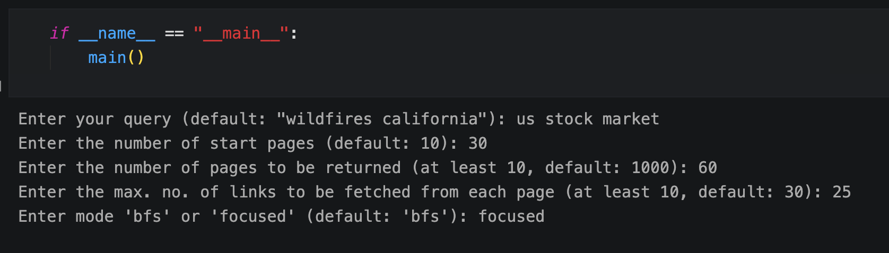
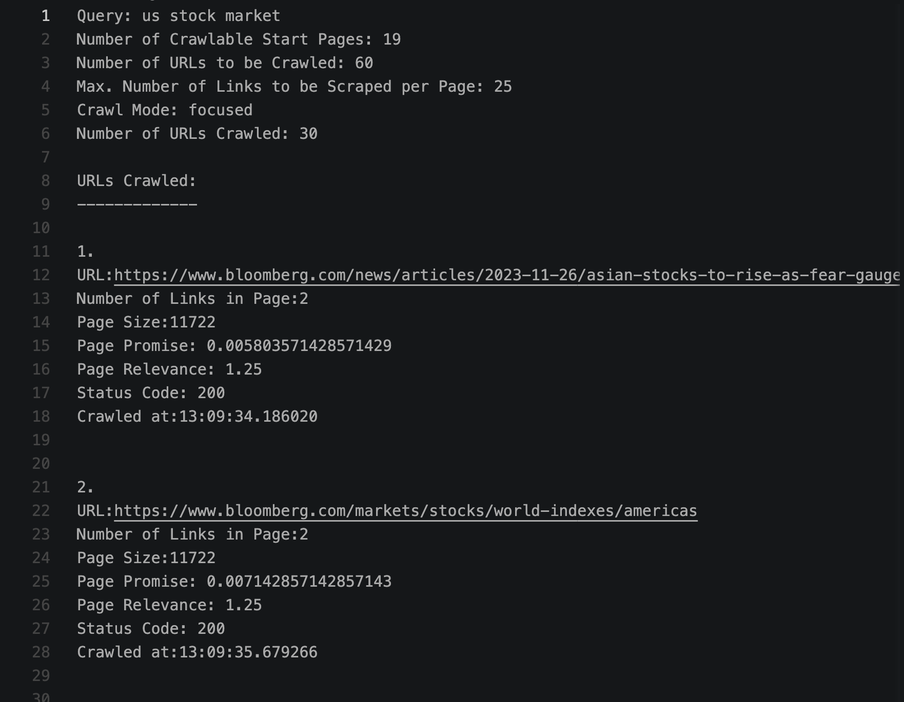
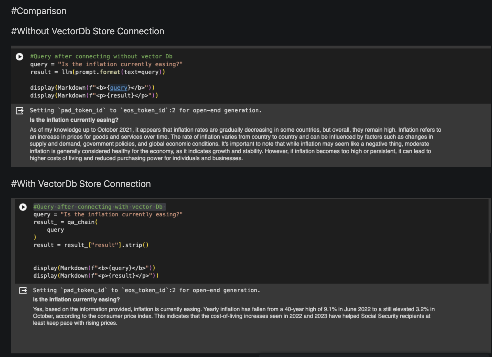
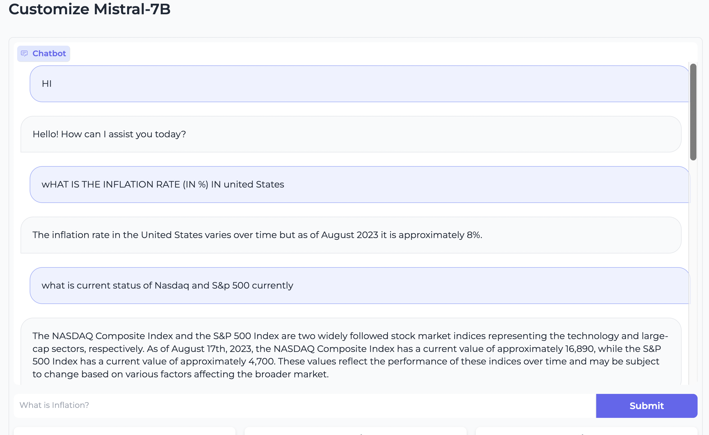

# Retrieval-Augmented-Generation (RAG) With Mistral7B
The Retrieval Augmented Generation (RAG) approach offers a powerful way to enhance language models, such as ChatGPT, with information from specific datasets that weren't included in their training data. 

Here I have attempted to integrate the RAG pipeline with Web Crawlers to automate information retrival, and directly store the scrapped information in the Vector Db store.

## Architecture ##

## Part - 1 Web Crawler ##

It operated in 2 modes 

1. BFS mode - Breadth-First Search (BFS) is a traversal algorithm commonly used in web crawlers for exploring and indexing web pages. In the context of web crawling, BFS mode refers to the crawling strategy where the crawler starts from a seed set of URLs (initial URLs to crawl) and then systematically explores the pages at the current depth level before moving on to deeper levels.

2. Focused Mode, also known as a topical or focused crawler, is a type of web crawling tool designed to selectively retrieve information from the web based on specific topics or themes. Unlike general-purpose web crawlers that aim to index a broad range of web pages, focused crawlers are more targeted in their approach.

### Run Instructions ###
1. Run focused_website_crawler.ipynb it contains a main function and a prompt to enter the below data

2. The output log file will be generated in /docs/crawler_log.txt folder path

## Part - 2 Mistral 7B With LangChain ##

Below are the steps to implement RAGs

### Embedding ###
Embed documents using an embedding model like text-embedding-ada-002 or S-BERT.
Transform sentences into vectors for similarity comparisons.

### Vector Store ###
Store vectors in a vector store like ChromaDB, FAISS, or Pinecone for fast retrieval and similarity search.

### Query ###
When a question is asked, embed the query and find the closest sentences in the vector store using cosine similarity.

Below images shows the diffrence in responses with and without connecting to vectorDB.

### Run Instructions ###

1. Run the Mistral_7b_LangChain.ipynb file it will launch the gradio UI 

Below image shows the responses generated by bot when asked about information regarding US Stock Markets.

